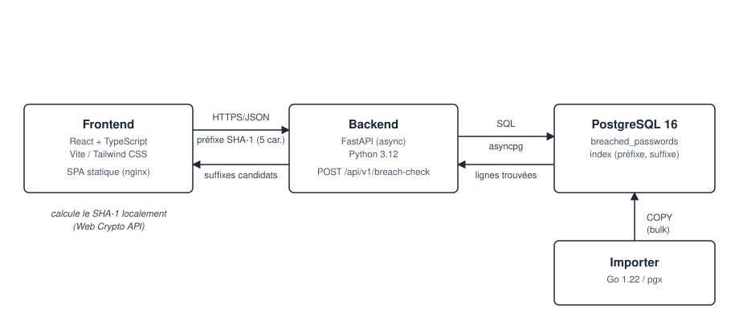

# RockYou Checker

Service de vérification de mots de passe compromis et de conformité aux
recommandations de l'**ANSSI**.

---

## 1. Vue d'ensemble de l'architecture



| Composant  | Rôle                                                                 | Techno                          |
|------------|-----------------------------------------------------------------------|----------------------------------|
| `frontend` | SPA de saisie et d'affichage des résultats                            | React 18, TypeScript, Vite, Tailwind CSS |
| `backend`  | API de vérification par préfixe de hash (k-anonymat)                  | Python 3.12, FastAPI, asyncpg   |
| `importer` | Chargement massif de `rockyou.txt` en base                            | Go 1.22, pgx (protocole COPY)   |
| `database` | Stockage des hashs (préfixe/suffixe) et comptage d'occurrences        | PostgreSQL 16                   |

Chaque composant est conteneurisé et orchestré via `docker-compose.yml`.

---

## 2. Modèle de confidentialité : k-anonymat (aucun mot de passe transmis)

C'est le point central de conception de ce projet : **le mot de passe en clair ne
quitte jamais le navigateur de l'utilisateur**, et son hash complet non plus.

1. Le frontend calcule le SHA-1 du mot de passe **localement**, via l'API Web
   Crypto native du navigateur (`crypto.subtle.digest`)  voir
   `frontend/src/services/crypto.ts`.
2. Seuls les **5 premiers caractères** hexadécimaux du hash (le « préfixe ») sont
   envoyés au backend (`POST /api/v1/breach-check`).
3. Le backend renvoie **toutes** les fins de hash (« suffixes ») connues pour ce
   préfixe, ainsi que leur nombre d'occurrences dans RockYou, jamais un
   booléen "compromis: oui/non" qui, lui, révélerait indirectement le mot de
   passe recherché.
4. Le frontend compare **localement** le suffixe de son propre hash à la liste
   reçue pour déterminer si le mot de passe est compromis.

Avec 5 caractères hexadécimaux de préfixe (16^5 = 1 048 576 combinaisons), un
préfixe donné correspond en moyenne à des dizaines de hashs différents dans un
corpus de 14 millions de mots de passe : le serveur ne peut donc jamais savoir
avec certitude quel mot de passe a été recherché. C'est exactement le modèle
retenu par l'API publique de Have I Been Pwned.

**Conséquence pratique** : les règles de conformité **ANSSI** sont, elles
aussi, entièrement évaluées côté client (`frontend/src/services/anssi.ts`),
sans aucun appel réseau. La même logique existe côté backend
(`backend/app/rules/anssi.py`) à des fins de tests unitaires et de
réutilisation potentielle (CLI, traitement par lot interne), mais elle n'est
**volontairement pas exposée** via une route HTTP recevant un mot de passe en
clair.

### Autres mesures de sécurité

- Requêtes SQL exclusivement paramétrées (`asyncpg`, `$1`) : pas d'injection SQL possible.
- Rate limiting par IP sur l'API (`slowapi`, 30 req/min par défaut).
- En-têtes de sécurité HTTP (`X-Content-Type-Options`, `X-Frame-Options`, `Referrer-Policy`, `Cache-Control: no-store`).
- CORS restreint à une liste blanche d'origines configurable.
- Conteneurs exécutés avec un utilisateur non-root (backend, importer, frontend/nginx).
- Aucun log applicatif ne contient de mot de passe, de hash complet ou d'adresse IP au-delà de ce que gère le rate limiter.

---

## 3. Architecture du backend (Python)

Le backend expose une seule route métier (`POST /breach-check`) adossée à une
seule requête SQL. La structure retenue reste légère, un dossier par
responsabilité :

```
backend/app/
├── main.py        # Composition root (assemblage de l'application)
├── core/
│   ├── config.py       # Configuration (pydantic-settings)
│   └── rate_limit.py   # Limiteur de requêtes (slowapi)
├── api/
│   ├── routes.py       # Endpoints FastAPI
│   └── schemas.py      # DTOs Pydantic (validation d'entrée/sortie)
├── db/
│   └── db.py           # Pool asyncpg + requête de recherche par préfixe
└── rules/
    ├── anssi.py         # Règles ANSSI : logique pure, testable sans I/O
    └── anssi_rules.json # Paramètres des règles (seuils, motifs...)
```

Deux principes structurants malgré tout :

- **`rules/anssi.py` n'a aucune dépendance d'infrastructure** : il ne connaît
  ni FastAPI ni asyncpg, et se teste unitairement sans base de données ni
  serveur HTTP (`backend/tests/`). C'est la seule logique métier non triviale
  du service ; elle mérite d'être isolée et testée indépendamment. Ses
  paramètres (`anssi_rules.json`) sont aussi la seule chose partagée avec le
  frontend (`frontend/src/anssi-rules.json`, copie identique, le mot de
  passe ne devant jamais quitter le navigateur, cette analyse doit tourner
  des deux côtés ; un test, `backend/tests/test_anssi_rules_sync.py`,
  garantit que les deux copies restent synchronisées).
- **Validation à la frontière, une seule fois** : `BreachCheckRequest`
  (`api/schemas.py`) valide et normalise `hash_prefix` (5 caractères
  hexadécimaux, mis en majuscules) avant même que la route ne s'exécute,
  `db.find_by_prefix` peut donc faire confiance à son argument sans le
  revalider, au lieu de dupliquer la même vérification à deux niveaux.

---

## 4. Pourquoi l'import en Go, et comment il est rapide

L'importeur Go (`importer/`) est conçu autour de trois idées :

1. **Pipeline concurrent** (`importer/internal/importer/importer.go`) :
   lecture séquentielle du fichier → hachage SHA-1 parallélisé sur N
   goroutines (CPU-bound) → écriture par lots sur M goroutines (I/O-bound),
   reliés par des channels Go. Le nombre de workers est configurable
   (`-hash-workers`, `-write-workers`, `-batch-size`).
2. **Chargement par `COPY`, pas par `INSERT`** : les lots de lignes sont
   envoyés au protocole `COPY` natif de PostgreSQL (`pgxpool.CopyFrom`), qui
   est un ordre de grandeur plus rapide que des `INSERT` unitaires ou même
   multi-valeurs.
3. **Table de staging `UNLOGGED`, sans index, sans clé primaire** pendant le
   chargement brut. Les 14M lignes (avec doublons) sont d'abord chargées
   telles quelles ; la déduplication et le comptage des occurrences se font
   **ensuite, en une seule requête `GROUP BY` côté PostgreSQL** (moteur
   optimisé pour ce type d'agrégation), avant `INSERT` dans la table finale
   indexée `breached_passwords`. Créer l'index après le chargement (plutôt
   que de le maintenir ligne à ligne) évite l'essentiel du surcoût.

```
main.go → importer.Run()
  ├─ db.PrepareStaging()      : CREATE UNLOGGED TABLE staging_passwords (...)
  ├─ pipeline concurrent      : lecture → hash SHA-1 → COPY par lots
  └─ db.FinalizeImport()      : INSERT ... SELECT ... GROUP BY ...
                                 DROP TABLE staging_passwords; ANALYZE;
```

SHA-1 est utilisé ici uniquement pour **indexer un corpus de fuite connu** et
permettre la recherche par préfixe façon HIBP, ce n'est pas une
recommandation de hachage pour stocker des identifiants applicatifs (qui
doivent utiliser `argon2id`/`bcrypt` avec sel, hors périmètre de ce projet).

---

## 5. Démarrage rapide

### Prérequis

- Docker et Docker Compose
- Le fichier `rockyou.txt` (non fourni dans le dépôt, voir `.gitignore`)

### 5.1. Lancer l'application

```bash
docker compose up --build -d
```

- Frontend : http://localhost:8080
- API : http://localhost:8000/api/v1 (documentation interactive : `/api/docs`)
- PostgreSQL : `localhost:5432` (user/password/db : `rockyou`)

Tant que l'import n'a pas été effectué, la base est vide : toute recherche
retournera "absent de la base RockYou".

### 5.2. Importer le corpus RockYou

1. Placer le fichier téléchargé dans `./data/rockyou.txt` (dossier créé à la
   racine du projet, ignoré par Git).
2. Lancer l'import (profil Docker Compose dédié, ne démarre pas avec `up`) :

```bash
docker compose --profile import run --rm importer
```

Options disponibles (voir `importer/main.go`) :

```bash
docker compose --profile import run --rm importer \
  -file /data/rockyou.txt \
  -hash-workers 8 \
  -write-workers 4 \
  -batch-size 20000
```

La progression (lignes lues/écrites, temps écoulé) est affichée toutes les 2
secondes dans les logs du conteneur.

### 5.3. Développement local (hors Docker)

```bash
# Backend
cd backend
python -m venv .venv && source .venv/bin/activate
pip install -r requirements-dev.txt
cp .env.example .env   # adapter DATABASE_URL si besoin
uvicorn app.main:app --reload

# Frontend
cd frontend
npm install
cp .env.example .env
npm run dev
```

### 5.4. Lancer les tests

```bash
# Backend (logique domaine, sans dépendance réseau/DB)
cd backend && pytest

# Frontend (règles ANSSI côté client)
cd frontend && npm run test
```

---

## 6. Structure du dépôt

```
.
├── docker-compose.yml
├── database/init.sql          # Schéma PostgreSQL
├── backend/                   # API Python (FastAPI)
├── importer/                  # Import Go haute performance
├── frontend/                  # SPA React/TS/Vite/Tailwind
└── docs/                      # Notes complémentaires
```

---

## 7. Stratégie de branches Git

Le dépôt est initialisé avec les branches suivantes :

| Branche              | Rôle                                                        |
|-----------------------|--------------------------------------------------------------|
| `main`                | Code stable, déployable                                     |

---

## 8. Pistes d'amélioration

- Le cas où `breached_passwords` contient déjà des données n'est pas géré :
  `FinalizeImport` suppose une table cible vide et n'effectue ni vérification
  ni `UPSERT` en cas de ré-import.
- L'estimation du nombre de mots de passe distincts par préfixe pourrait être
  affichée pour illustrer davantage le principe de k-anonymat.
- Un cache (Redis) sur les préfixes les plus demandés réduirait encore la
  charge PostgreSQL en production à fort trafic.
- Le protocole `COPY` de l'importeur pourrait être remplacé par
  `pg_bulkload`/partitionnement pour viser un temps d'import inférieur à 40s
  sur du matériel modeste.
